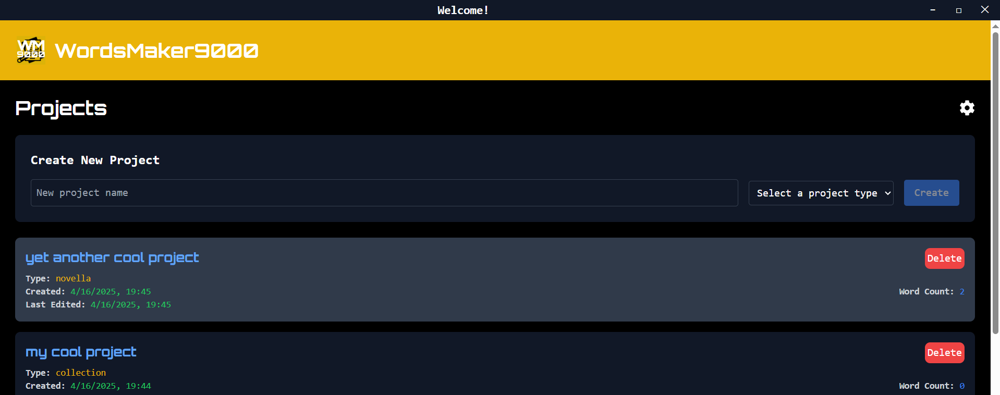
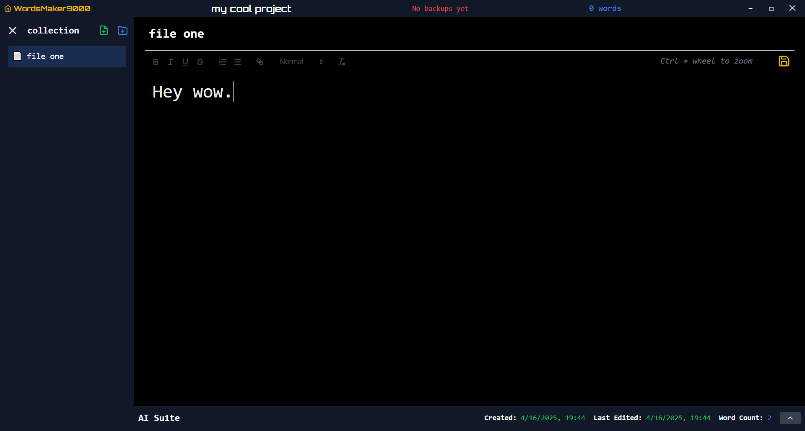

# Wordsmaker9000

Welcome to **Wordsmaker9000**!

As a writer, I was sick of Word's overcomplicated interface and features I never used. I wanted a simple local desktop application that could save files to a project, word count, backup, simple rich text edit, auto-save, and more, in a style all my own. The biggest difference for me is having a VS Code like side-drawer with all my files in a project and being able to quickly switch between them.

More than that, I wanted more custom control over the AI prompts used to look at my writing.

It's a simple app, but it's mine!





## Technical Overview

- **Frontend:** Built with React and TypeScript, leveraging Vite for ultra-fast hot module replacement and streamlined builds.
- **Native Integration:** Utilizes Tauri for desktop applications, harnessing the power of Rust for improved performance.
- **Build & Bundle:** Optimized development with Vite and robust packaging through Tauri, ensuring smooth transitions from development to production.
- **Quality & Linting:** Enforces code quality with ESLint and strict TypeScript configurations.
- **Modern Toolchain:** Supports advanced tooling through Babel/SWC powered plugins to keep your setup modern and efficient.

## Features

- **React + TypeScript:** A statically typed, component-based architecture for robust, scalable UIs.
- **Vite Build System:** Lightning-fast builds and efficient development cycles.
- **Tauri Integration:** Native desktop app support with a Rust-powered backend.
- **Tailwind CSS:** Pre-configured utility-first CSS framework for rapid styling and responsive design, enabling highly customizable and consistent user interfaces.
- **Production Ready:** Easy to build and bundle for production use.
- **OpenAI Integration:** Supports integration with OpenAI APIs. Simply add your API key in a `.env` file to get started.

## Getting Started

1. **Install Dependencies**  
   Run the following command in your terminal:

   ```
   npm install
   ```

2. **Start the Development Server**  
   Launch the application with:

   ```
   npm run dev
   ```

3. **Explore Tauri Integration**  
   Experience native desktop features by running:
   ```
   npm run tauri dev
   ```

## Running Jest Tests

To run the Jest tests for Wordsmaker9000, execute:

```
npm run test
```

This command will run all the tests configured in the project using Jest. Refer to `jest.config.cjs` for custom configurations.

## Publish Your App

To publish Wordsmaker9000 as a desktop application:

1. **Build the Application:**  
   Create a production build:

   ```
   npm run build
   ```

2. **Package with Tauri:**  
   Bundle your app:

   ```
   npm run tauri build
   ```

   The packaged application will be available in the `src-tauri/target/release` directory.

3. **Deploy:**  
   Distribute your app through your preferred channels, such as direct downloads or app stores.

## Configuring OPEN_AI Key

For OpenAI integrations:

1. **Obtain an API Key:**  
   Register at [OpenAI](https://platform.openai.com/) and secure your API key.

2. **Set the API Key:**  
   Create a `.env` file in the project root (if it’s not already present) and add:

   ```
   OPEN_AI_KEY=your_api_key_here
   ```

   Replace `your_api_key_here` with your actual API key. Ensure this file is included in your `.gitignore` to protect your API credentials.

3. **Automatic Detection:**  
   The application automatically reads the `OPEN_AI_KEY` environment variable to enable OpenAI features.

## Dive Deeper

Explore these resources to learn more about the technologies powering Wordsmaker9000:

- [React](https://reactjs.org/)
- [Vite](https://vitejs.dev/)
- [Tauri](https://tauri.app/)
- [Tailwind CSS](https://tailwindcss.com/)

---

Embrace the innovation, enjoy the journey, and happy coding with Wordsmaker9000!
