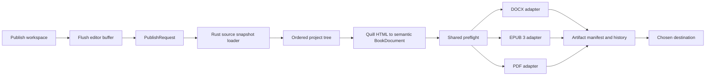

# Export and Publishing Roadmap

Last reviewed: 2026-07-14

## Executive summary

WordsMaker9000 already has the right high-level shape for a publishing pipeline: the React UI collects a request, a Tauri command compiles the project in Rust, adapters create artifacts, progress is emitted back to the UI, and completed exports are retained per project.

The limiting factor is not the absence of more format buttons. The current compiler converts Quill HTML directly into a small, PDF-oriented structure that loses document semantics. Adding DOCX or EPUB on top of that structure would reproduce the existing content loss and layout assumptions in every new format.

The recommended sequence is therefore:

1. Stabilize the existing export path and fix correctness issues.
2. Introduce a format-neutral semantic book model.
3. Reimplement the existing PDF adapter over that model.
4. Add DOCX as the first new output.
5. Add EPUB 3.3 with standards validation.
6. Upgrade PDF from a proof copy to a tested print-book output.
7. Add the richer Publish workspace, previews, profiles, preflight, and artifact history.

The product target is **Atticus-like simplicity over the existing project tree**, not a clone of Scrivener's full Compile interface.

## Scope

### Primary outcomes

- A standard manuscript DOCX for agents, editors, and critique partners.
- A clean DOCX for handoff to other formatting tools.
- A reflowable, accessible EPUB 3.3.
- A print PDF with explicit trim, margins, pagination, and font handling.
- Reusable publish profiles and structured book metadata.
- Preflight results that prevent silent data loss and predictable retailer failures.
- Artifact history that supports more than PDF.

### Explicit non-goals for the first release

- Uploading directly to KDP, IngramSpark, Apple Books, Kobo, or Draft2Digital.
- ISBN purchasing or registration.
- DRM application.
- A full print-cover designer.
- Audiobook generation.
- Highly designed textbooks, comics, cookbooks, or fixed-layout ebooks.
- Full feature parity with Scrivener's general-purpose Compile system.

## Current architecture

### Frontend

- The editor is `react-quill-new` and persists Quill-generated HTML as a string. See [`TextEditor.tsx`](../src/components/projectComponents/TextEditor.tsx).
- The visible toolbar currently creates bold, italic, underline, strike, ordered-list, and bullet-list markup.
- Each text file is stored as `{ "content": "<p>...</p>" }` in a UUID-named JSON file under application data. See [`fileManager.ts`](../src/utils/fileManager.ts).
- Project structure is stored in `metadata.json` as a flat `ExtendedNodeModel[]` with `id`, `parent`, array order, and a `file | folder` distinction. See [`ProjectPageTypes.ts`](../src/types/ProjectPageTypes.ts).
- `projectType` is persisted as `novel`, `novella`, `collection`, or `serial`, but it currently affects labeling/metadata only; project creation and export do not apply type-specific structure or compilation rules.
- The export modal reads every project file sequentially in the webview, sends the full project across Tauri IPC, listens for global progress events, and opens the finished file. See [`ExportModal.tsx`](../src/components/projectComponents/modals/ExportModal.tsx).

### Rust backend

- `export_project` receives all node content, calls `compile`, and always invokes the PDF adapter. See [`export/mod.rs`](../src-tauri/src/export/mod.rs).
- `compiler.rs` performs both structure interpretation and HTML parsing.
- `pdf_adapter.rs` performs layout and writes the artifact using `genpdf`.
- The current stack is Tauri 2, Rust 2021, Serde, `scraper`/`ego-tree`, and `genpdf` over `printpdf`.
- Exports are placed under `Projects/<project>/exports` and discovered by scanning for `.pdf` files.

### Existing flow


## Findings that affect implementation

### 1. Tree order is not faithfully compiled

The project array is the user's visible order, but the compiler first collects all root folders and then all root files. Interleaved root items are therefore reordered. It also walks only root folders, their direct files, and one additional folder level. Deeper content is omitted.

Automatic chapter numbering is also incorrect for multiple root files because the calculation combines the growing `chapters.len()` with the loop index. At the time of this review, `cargo test` fails `test_top_level_files_only`: the second file compiles as `Chapter 3` instead of `Chapter 2`.

The replacement traversal must:

- preserve sibling order from `treeData`;
- support arbitrary depth;
- reject or report cycles and missing parents;
- preserve empty structural nodes when they have a publishing role;
- use explicit roles where present and safe inference where absent.

### 2. File-read failures silently become empty chapters

`ExportModal` catches a read error and replaces the content with an empty string. A successful export can therefore omit prose without telling the writer.

Publishing must fail or produce a blocking preflight error naming the affected project node. There should be no silent content substitution.

### 3. Unsaved editor content can be omitted

The current export reads files from disk. The selected editor buffer may be newer than the last autosave. The Publish action must first await a `flushCurrentDocument()` operation, then create a source snapshot. A failed flush must block publishing.

### 4. The intermediate model is too lossy

`TextElement` retains text, bold, italic, and a small block enum. The parser currently loses or conflates:

- underline and strike;
- ordered versus unordered lists;
- list nesting;
- hyperlinks;
- paragraph alignment, indent, and direction;
- semantic heading level;
- block quotes;
- images, alt text, captions, and asset identity;
- footnotes/endnotes;
- scene breaks versus ordinary horizontal rules;
- explicit page breaks;
- arbitrary attributes needed by accessible EPUB.

Not every output must visually support every property, but the compiler must retain the property so that each adapter can render it, deliberately transform it, or emit a warning.

### 5. Structure has no publishing semantics

`file` and `folder` are organization concepts, not book concepts. A folder might be a part, a chapter container, a research folder, or a volume. A file might be a scene, chapter, dedication, copyright page, or author bio.

The existing `projectType` values — `novel`, `novella`, `collection`, and `serial` — are therefore important export inputs. They should choose the initial interpretation strategy, vocabulary, metadata fields, validation rules, and available export scopes. They should not permanently hard-code every node's role because the current application does not enforce a type-specific tree structure and existing writers may organize projects differently.

Publishing roles should be stored separately from the core tree, inferred initially from `projectType` plus tree shape, shown to the writer in the Publish outline, and persisted after confirmation. This avoids breaking existing projects and keeps research organization independent from output formatting.

### 6. Development and production project paths can diverge

The frontend uses `Dev_Projects` in development, while the Rust export code always uses `Projects`. Export source loading, artifact history, and path naming should be centralized behind one Rust path service or receive the resolved base directory from one authoritative configuration.

### 7. Large exports should not run as blocking work on the async command path

Future DOCX, EPUB, image, validation, and PDF work will be CPU- and filesystem-heavy. Use `tauri::async_runtime::spawn_blocking` for compilation and rendering. Progress messages should include an `export_id`; otherwise concurrent or stale listeners cannot distinguish jobs.

### 8. Output handling should use Tauri plugins

The current `open_file_default` command manually invokes `cmd /C start`, `open`, or `xdg-open`. Use the Tauri opener plugin for opening artifacts and the dialog plugin for native Save As/folder selection. This removes a shell boundary and improves cross-platform consistency.

### 9. The repository needs a green baseline before feature work

At the time of this review:

- Rust: 11 export tests pass and `test_top_level_files_only` fails because of the chapter-numbering defect described above.
- TypeScript/Jest: 36 tests pass and one `createProject` test fails because its `mkdir` expectation does not include the implementation's `recursive: true` option.

Restore both suites before beginning the semantic compiler so new failures can be attributed to the roadmap work. The Jest mismatch is not itself a publishing defect, but it weakens the baseline quality gate.

## Target architecture



### Recommended backend module layout

```text
src-tauri/src/publishing/
  mod.rs                 # Tauri commands and job orchestration
  model.rs               # Format-neutral BookDocument IR
  request.rs             # PublishRequest, result, progress, errors
  source.rs              # Project paths, snapshot loading, ordered tree
  project_types.rs       # Type-specific role inference, defaults, and scope
  html.rs                # Quill HTML -> semantic blocks/inlines
  profiles.rs            # Profile defaults and validation
  preflight.rs           # Shared and format-specific diagnostics
  artifacts.rs           # Filenames, manifests, history, copying
  adapters/
    mod.rs
    docx.rs
    epub.rs
    pdf.rs
```

The existing `export` module can remain as a compatibility wrapper until the current PDF UI is replaced.

### Recommended frontend layout

```text
src/types/PublishingTypes.ts
src/agents/publishingAgent.ts
src/components/projectComponents/publishing/
  PublishWorkspace.tsx
  PublishDestinationPicker.tsx
  PublishOutline.tsx
  BookMetadataForm.tsx
  FormatSettings.tsx
  PreflightResults.tsx
  PublishProgress.tsx
  ArtifactHistory.tsx
```

### Core request contract

The frontend should stop sending the complete book content across IPC. It should send identifiers and settings; Rust should create a consistent on-disk source snapshot after the editor flush.

```text
PublishRequest
  export_id
  project_name
  project_type
  publication_scope
  profile_id
  formats[]
  destination
  metadata_overrides
  node_overrides
```

`ExportProgress` should become a job-scoped event:

```text
PublishProgress
  export_id
  phase       # snapshot | compile | preflight | render | validate | copy
  message
  current
  total
  severity
```

### Semantic book model

The shared model should be serializable for snapshot tests but remain internal to Rust during normal publishing.

```text
BookDocument
  metadata
  sections[]
  assets[]

BookSection
  source_node_id
  role        # front matter, part, chapter, scene, back matter, etc.
  title
  inclusion
  blocks[]
  children[]

Block
  paragraph(inlines, paragraph_style)
  heading(level, inlines)
  ordered_list(items)
  bullet_list(items)
  block_quote(blocks)
  scene_break(style)
  page_break
  image(asset_id, alt, caption)
  footnote_definition(id, blocks)

Inline
  text
  bold
  italic
  underline
  strike
  link
  footnote_reference
```

Use enums instead of stringly typed fields such as `file_type`. Unknown future enum values should produce a clear migration error rather than being treated as a file.

### Source identity and scene boundaries

Every source tree node must appear at most once in the semantic outline. A root file is compiled directly as the type-appropriate publication unit: chapter for a novel/novella, work for a collection, or installment for a serial, with its title, source-node ID, and prose blocks on that section. Legacy `Chapter N` wrappers are presentation details and must not become a second editable section or reuse the file's source-node ID. Actual chapter folders retain their child scene files as recursive `scene` sections.

A root-file chapter's direct prose is its implicit first scene. Conventional standalone manuscript separators should divide additional untitled scenes inside that file without inventing source nodes:

- a paragraph whose trimmed content is exactly `#`;
- a paragraph whose trimmed content is exactly `***` or `* * *`;
- a semantic horizontal rule (`<hr>`).

The Quill parser should convert these markers to `scene_break` blocks. It must not treat a marker embedded in prose, Markdown heading syntax, or ordinary blank paragraphs as a scene boundary. Tree-based scene files remain the representation for scenes that need titles, role/inclusion overrides, or independent publication scope. A later explicit scene-break editor element should emit the same semantic block without requiring typed marker recognition.

## Project type export behavior

Project type should affect compilation before an output adapter is selected. DOCX, EPUB, and PDF should all receive the same type-aware `BookDocument`; adapters should not independently reinterpret a project as a novel, collection, or serial.

### Recommended strategy

Implement a `ProjectTypeStrategy` that provides:

- default role inference for root and nested nodes;
- user-facing terminology in the Publish outline;
- supported publication scopes;
- default metadata fields;
- default front/back matter;
- type-specific validation and warnings;
- suggested DOCX, EPUB, and print profiles.

The result of inference must remain editable. On first publish, show the inferred outline and require confirmation when the structure is ambiguous. Once confirmed, persist node-role overrides in `publishing.json` so later exports are deterministic.

### Type-specific defaults

| Project type | Primary publication units | Default interpretation | Export behavior and metadata |
| --- | --- | --- | --- |
| Novel | Parts, chapters, scenes | Root files may be chapters; root folders may be chapter containers or parts; nested files are commonly scenes | Export the complete manuscript by default; chapter numbering and recto starts are available; metadata emphasizes title/subtitle, author, edition, language, and optional series membership |
| Novella | Chapters and scenes | Use the novel strategy with a shallower default outline and no assumed parts | Export the complete work by default; use the same industry formats as a novel, but avoid inventing parts or extra hierarchy merely because the project is shorter |
| Collection | Stories/works, with optional sections or scenes | Root items are individual works; a root folder can contain the sections/scenes of one work | TOC and navigation use story titles rather than generated chapter numbers; each work starts a new print page and EPUB spine document; allow whole-collection or selected-work export; support optional per-work author/byline metadata |
| Serial | Installments/episodes, optional volumes/seasons, chapters, and scenes | Root items are installments unless explicitly grouped into a volume/season; descendants form the installment's internal structure | Allow one-installment, selected-installments, volume/season, or complete-series compilation; include series title plus installment/volume numbering; support installment-specific front/back matter and omnibus output without duplicating shared matter |

These are defaults, not migration rules. For example, a writer may keep research folders beside manuscript folders or may use one file per scene at the root. Ambiguous nodes should be marked `unassigned` or `excluded` until confirmed rather than being silently forced into the output.

### Publication scope

Add an explicit scope to the publish request instead of assuming the entire tree is always exported:

```text
PublicationScope
  full_project
  selected_nodes[]
  single_work(node_id)          # collection
  single_installment(node_id)   # serial
  volume(node_id)               # serial/omnibus
```

Scope selection must include required ancestors for headings/navigation and may optionally include shared front/back matter. The preflight should show exactly what is included before rendering.

### Type-aware validation examples

- Novel/novella: warn about duplicate or missing chapter titles and scenes that are not assigned to a chapter when the chosen profile requires chapters.
- Collection: block duplicate work identifiers in EPUB navigation; warn when a work has no title; never replace story titles with `Chapter N` without an explicit profile choice.
- Serial: warn about missing or duplicate installment numbers, gaps when exporting a continuous volume, and duplicated shared front/back matter in omnibus output.
- All types: exclude research by explicit role, not by folder depth or naming convention alone.

## Publishing configuration and migration

Create a lazily initialized, schema-versioned `publishing.json` beside `metadata.json`:

```json
{
  "schema_version": 1,
  "project_type_strategy": {},
  "book_metadata": {},
  "node_roles": {},
  "profiles": {},
  "default_profile_by_format": {}
}
```

Guidelines:

- Do not require existing projects to migrate before opening.
- Infer roles from `projectType` and the current tree until a writer confirms or customizes them.
- Record the strategy version used for inference so future heuristic improvements do not silently change an existing publish outline.
- Keep the home-screen `metadata.json` lightweight.
- Key node overrides by stable node ID and discard orphaned overrides during a controlled cleanup.
- Store dates as UTC ISO 8601 strings at the persistence boundary.
- Add `schema_version` before introducing assets or more complex editor storage.

For artifacts, move toward:

```text
exports/
  <export-id>/
    manifest.json
    Book Title.docx
    Book Title.epub
    Book Title - 6x9.pdf
```

The manifest should record source revision/hash, creation time, profile, formats, filenames, diagnostics, and application version. Existing flat PDFs can be displayed as legacy artifacts without rewriting them.

## Technology choices

### Quill HTML parsing

Keep `scraper`/`ego-tree` for the first refactor. The problem is the current target model and traversal, not the DOM parser. Build fixture-based parsing tests from real Quill output before expanding the editor toolbar.

The first semantic parser should fully preserve every format the editor can currently create:

- paragraphs and soft breaks;
- bold, italic, underline, and strike;
- ordered and unordered lists, including nesting;
- Unicode punctuation and smart quotes.

Headings, links, block quotes, scene breaks, and images can then be added end-to-end, one feature at a time.

### DOCX

Implement DOCX in Rust so all formats share the same source model and the installed desktop app does not depend on a Node runtime.

Start with a dependency spike against `docx-rs` 0.4 rather than committing immediately. It exposes styles, numbering, hyperlinks, images, sections, and footnotes, but its API documentation is sparse enough that compatibility must be demonstrated.

Spike acceptance:

- builds with the project's supported Rust toolchain;
- opens without repair warnings in current Microsoft Word and LibreOffice;
- supports named paragraph styles, page/section breaks, numbering, headers/footers, and metadata;
- preserves Unicode and all current Quill formatting;
- produces deterministic-enough package XML for structural tests;
- has acceptable binary-size and compile-time impact.

Provide two initial profiles:

1. **Standard Manuscript** — title page, configurable contact block, 12 pt manuscript font, double spacing, one-inch margins, page header, chapter page breaks.
2. **Clean Handoff** — semantic headings and restrained formatting for editors or downstream formatters.

### EPUB 3.3

Generate reflowable EPUB in Rust from semantic XHTML and CSS. Evaluate available EPUB crates against EPUB 3.3 requirements; if they hide or prevent required package/nav/accessibility markup, use a narrow packaging layer over a ZIP and XML writer instead of accepting an EPUB 2-shaped abstraction.

Initial EPUB scope:

- EPUB 3 package metadata;
- one XHTML document per meaningful section;
- manifest and linear spine;
- required navigation document and TOC;
- landmarks for title page, body matter, and back matter;
- reflowable CSS with reader-controlled body typography;
- cover metadata and cover asset;
- language and direction metadata;
- semantic headings and list markup;
- live external links when link support reaches the editor;
- alt text/decorative-image semantics when image support reaches the editor.

Use the official W3C EPUBCheck in CI on generated golden books. Runtime packaging of EPUBCheck requires a separate decision because the official checker is Java-based; do not silently add a Java/JRE dependency to the desktop bundle. The application can still provide a fast internal preflight while CI proves standards conformance.

### PDF

`genpdf` can support an incremental first step. It already provides custom paper sizes, asymmetric margins, embedded fonts, headers through page decorators, optional images, and optional hyphenation. A custom `PageDecorator` can add footers and page-dependent margins.

Before calling the output “print-ready,” address:

- bundled, redistributable fonts instead of OS font discovery;
- common trim-size presets and arbitrary page sizes;
- inside/outside margins and gutter rules;
- recto/verso behavior and intentional blank pages;
- front-matter versus body pagination;
- running heads and page-number suppression rules;
- chapter/scene styling;
- image resolution, scaling, and bleed validation;
- PDF metadata and chosen conformance settings;
- widow/orphan behavior and long-word handling;
- hyperlinks and footnotes if required for the target profile.

Run a renderer decision spike after the semantic model exists:

| Option | Advantages | Risks |
| --- | --- | --- |
| Extend `genpdf` | Lowest migration cost, pure Rust, existing tests and code | Advanced book pagination and typography require custom elements/decorators; older and limited high-level API |
| Embed Typst | Strong typesetting, Rust implementation, modern PDF standards and reusable templates | Larger dependency/build impact; requires a secure IR-to-Typst translation and bundled fonts/assets |
| HTML/CSS paged rendering | Shares web styling concepts and can make preview approachable | Cross-platform PDF fidelity and headless-browser packaging are substantial operational risks |

Do not choose a replacement solely from feature lists. Generate the same acceptance manuscript with `genpdf` and the leading alternative, then compare page control, output validity, build size, speed, and cross-platform packaging.

### Fonts and assets

- Bundle at least one commercially redistributable serif family with regular, bold, italic, and bold-italic faces.
- Record its license in the application distribution.
- Keep editor themes separate from publishing typography; UI web fonts are not automatically licensed or suitable for embedding.
- Introduce `assets/` inside each project before supporting body images.
- Store asset IDs in Quill custom blots rather than base64 image data in document JSON.
- Store alt text, decorative status, caption, source dimensions, and MIME type with the asset.

### Native file operations

- Add `tauri-plugin-dialog` for Save As and output-folder selection.
- Add `tauri-plugin-opener` for opening files/folders.
- Keep canonical artifact generation in the Rust backend.
- Generate to an internal temporary/artifact location, validate, then copy atomically to the selected destination.
- Grant only the Tauri permissions required by the selected plugins.

## Roadmap

Effort is relative and assumes one engineer familiar with the current codebase. It is not a calendar estimate.

| Phase | Outcome | Effort | Depends on |
| --- | --- | --- | --- |
| 0 | Correct and testable existing PDF export | M | None |
| 1 | Semantic compiler and publishing persistence | L | Phase 0 |
| 2 | DOCX manuscript and handoff exports | M | Phase 1 |
| 3 | Valid reflowable EPUB 3.3 | L | Phase 1 |
| 4 | Tested print-book PDF profiles | XL | Phase 1 and renderer spike |
| 5 | Full Publish workspace, previews, preflight, history | L | Phases 2–4 incrementally |
| 6 | Rich content and advanced publishing | Ongoing | Core outputs stable |

### Phase 0 — stabilize the current exporter

Deliverables:

- Add ordered, recursive tree traversal with tests.
- Preserve interleaved folders/files and arbitrary depth.
- Fix automatic chapter numbering; restore the currently failing `test_top_level_files_only` baseline.
- Block export on file-read failure instead of inserting empty content.
- Expose and await `flushCurrentDocument()` before source collection.
- Centralize `Projects` versus `Dev_Projects` resolution.
- Add `export_id` to progress events and results.
- Move CPU/filesystem rendering into `spawn_blocking`.
- Replace manual OS opening with the Tauri opener plugin.
- Add a native destination chooser while retaining an internal history copy.
- Add an integration fixture representing a small novel with nested folders and mixed formatting.

Exit criteria:

- No visible project node is reordered or silently omitted.
- Export always includes the current editor buffer.
- Errors name the affected file/node.
- Existing PDF behavior remains available.
- Rust tests cover tree assembly and all current Quill formats.

### Phase 1 — introduce the semantic compiler

Deliverables:

- Add the `publishing` module and `BookDocument` model.
- Split source loading, tree assembly, HTML parsing, preflight, and rendering.
- Parse current Quill formats without loss.
- Add intrinsic publishing roles and per-format inclusion rules.
- Add a `ProjectTypeStrategy` for novel, novella, collection, and serial projects.
- Enforce one semantic section per source-node ID and collapse legacy root-file wrappers before role inference.
- Parse conventional standalone `#`, `***`, `* * *`, and `<hr>` scene separators into `scene_break` blocks while preserving ordinary blank paragraphs.
- Add type-aware publication scopes, terminology, metadata defaults, and validation.
- Add `publishing.json` with lazy migration/defaults.
- Port the existing PDF adapter to consume `BookDocument`.
- Add IR snapshot tests and adapter-neutral fixtures.

Exit criteria:

- The same compiled `BookDocument` feeds every adapter.
- PDF code contains no HTML parsing or project-tree traversal.
- Existing projects publish without manual migration.
- Each project type has a tested default outline and the writer can override it.
- Unsupported content becomes a diagnostic, not silent deletion.

### Phase 2 — ship DOCX first

Deliverables:

- Complete the `docx-rs` compatibility spike and record the dependency decision.
- Implement Standard Manuscript and Clean Handoff profiles.
- Support title page, chapters, page breaks, body paragraphs, current inline styles, and both list types.
- Render tree-based scenes and in-file `scene_break` blocks by profile: centered `#` separators with hidden scene titles for Standard Manuscript, and named scene-heading/break styles for Clean Handoff.
- Add header/page numbering for Standard Manuscript.
- Add DOCX-specific preflight and artifact history.
- Test output in Word and LibreOffice on representative platforms.

Why DOCX first:

- It fills the agent/editor workflow immediately.
- It exercises semantic styles, sections, numbering, and package generation without EPUB's full accessibility surface.
- It provides a useful fallback while print and ebook rendering mature.

Exit criteria:

- Word and LibreOffice open the file without repair warnings.
- Text order and current editor formatting are preserved.
- The standard manuscript fixture matches the documented profile.

### Phase 3 — ship EPUB 3.3

Deliverables:

- Add structured book metadata and ebook cover selection.
- Generate OPF metadata, manifest, spine, navigation TOC, and landmarks.
- Generate semantic XHTML and reflowable CSS.
- Add EPUB-specific inclusion rules for front/back matter.
- Add internal preflight for missing metadata, duplicate IDs, broken links, missing assets, and missing alt text.
- Add official EPUBCheck validation to CI fixtures.
- Verify fixtures in Kindle Previewer and Apple Books during release qualification.

Exit criteria:

- Golden EPUBs pass EPUBCheck with zero errors.
- Navigation order exactly matches the Publish outline.
- The book remains readable with reader-selected font size and family.
- Accessibility metadata accurately describes supported features.

### Phase 4 — upgrade PDF to print-book output

Deliverables:

- Complete the renderer comparison ADR using a shared acceptance manuscript.
- Bundle licensed font families.
- Add initial trim presets such as 5×8, 5.25×8, 5.5×8.5, and 6×9 inches.
- Add mirrored margins, gutter, chapter start side, headers/footers, and page-number rules.
- Add front-matter/body pagination controls.
- Add print image and bleed preflight when asset support is available.
- Add separate “Proof PDF” and “Print Interior PDF” profiles so quality claims are explicit.
- Test representative files through KDP and IngramSpark preview/preflight workflows before labeling them publish-ready.

Exit criteria:

- Page dimensions and margins match the selected profile.
- Fonts are embedded and verified.
- Page numbering and intentional blank pages follow profile rules.
- The acceptance manuscript passes the selected print-provider checks.

Implementation status (2026-07-30): the renderer ADR, bundled fonts, Proof PDF
compatibility, initial Print Interior profile, four trim presets, mirrored
margins/gutter, structural recto starts, running heads, and front/body folio
rules are implemented. Automated structural and headless Publish QA checks are
in place. KDP/IngramSpark qualification remains a manual release gate, and
image/bleed preflight remains deferred until project asset support is available.

### Phase 5 — complete the Publish experience

The current modal can evolve incrementally; a big-bang UI rewrite is unnecessary.

Deliverables:

- Replace “Export to PDF” with destination cards: Manuscript, Ebook, Print.
- Add a type-aware Publish outline with include/exclude and inferred role overrides.
- Add scope selection appropriate to the type: full work, selected stories, installment, or volume.
- Add metadata and format-settings panels.
- Save named profiles per project.
- Show blocking errors separately from warnings and information.
- Preview the actual generated artifact, not a separate approximation.
- Generalize Export Versions into Artifact History backed by manifests.
- Add regenerate, reveal in folder, copy to destination, and delete-history actions.
- Add cancellation only after job-scoped progress and cleanup are reliable.

Exit criteria:

- A default export requires only destination choice and confirmation.
- Advanced controls remain available without becoming the default path.
- Re-running a saved profile is deterministic for the same source snapshot.

### Phase 6 — rich content and advanced profiles

Add only after the core formats are stable:

- explicit scene-break editor element;
- headings, links, and block quotes in the editor;
- project asset management and accessible images;
- footnotes/endnotes;
- reusable front/back-matter templates and master pages;
- large-print and hardcover profiles;
- right-to-left and vertical writing support;
- box sets/volumes;
- advanced nonfiction tables and callouts;
- direct-sales bundles and reusable “Also By” pages.

## Suggested implementation slices

Keep pull requests narrow enough to preserve the existing export while the new path is built:

1. **Export correctness tests and fixes** — tree order, depth, read errors, unsaved buffer.
2. **BookDocument IR** — no new user-visible output.
3. **Quill parser fixtures** — all current toolbar markup into IR.
4. **Publishing config** — schema, defaults, role inference, persistence.
5. **PDF compatibility adapter** — current PDF through the new IR.
6. **DOCX spike and adapter**.
7. **EPUB packaging and CI validation**.
8. **PDF renderer ADR and print profiles**.
9. **Publish workspace and artifact manifests**.
10. **Assets and richer editor semantics**.

## Test strategy

### Unit tests

- Tree traversal: mixed root items, arbitrary depth, empty nodes, missing parents, cycles, and deletion orphans.
- HTML parsing: fixtures copied from actual Quill output for every supported toolbar action.
- Semantic IR: snapshot tests for a small novel, novella, collection, and serial.
- Project-type strategies: inference, terminology, metadata defaults, scope expansion, ambiguity handling, persisted overrides, unique source-node identities, and direct root-file chapters/works/installments.
- Scene boundaries: recognize standalone `#`, `***`, `* * *`, and `<hr>` markers; reject false positives inside prose or headings; retain blank paragraphs as non-semantic spacing.
- Profile defaults and migrations.
- Filename sanitization and collision behavior.
- Preflight diagnostics with stable codes, severity, node ID, and suggested remediation.

### Adapter structural tests

- DOCX: unzip and inspect WordprocessingML, styles, numbering, relationships, and section properties.
- EPUB: verify ZIP/mimetype rules, parse OPF/nav/XHTML, resolve every manifest/spine/link reference, and run EPUBCheck in CI.
- PDF: inspect page boxes, metadata, page count, and embedded fonts; do not byte-snapshot entire PDFs.

### Golden manuscripts

Maintain a small set of source projects containing:

- interleaved folders and files;
- at least three levels of nesting;
- empty and very long chapters;
- bold/italic/underline/strike combinations;
- ordered and nested bullet lists;
- root-file chapters plus folder chapters containing multiple child scene files;
- standalone and inline uses of `#` and asterisks to exercise scene-break recognition;
- curly quotes, em dashes, accented Latin text, and non-Latin Unicode;
- later: links, images with/without alt text, footnotes, and explicit page breaks.

### Cross-platform and performance checks

- Build and export on Windows, macOS, and Linux before a publishing release.
- Establish a reference 100k–150k word project and record export time, peak memory, and artifact size.
- Keep the UI responsive during compilation and rendering.
- Verify cleanup after failed and cancelled jobs.

## Definition of “publish-ready”

Do not use this label merely because a file has the correct extension.

An output profile is publish-ready only when:

- its layout and metadata rules are documented;
- it has blocking preflight for known provider requirements;
- generated golden files pass the relevant standards/tool validation;
- it has been exercised in the target provider's preview or preflight workflow;
- failures do not silently omit or transform user content;
- the artifact manifest identifies the source revision and profile used.

Until then, label outputs accurately as “Proof PDF,” “EPUB preview,” or “DOCX handoff.”

## Principal risks and mitigations

| Risk | Mitigation |
| --- | --- |
| New adapters reproduce current content loss | Complete the semantic IR and parser fixtures first |
| A PDF renderer migration consumes the roadmap | Keep proof PDF working; require an acceptance-manuscript ADR before switching |
| Runtime EPUB validation makes the app much larger | Use internal preflight in-app and official EPUBCheck in CI until packaging is justified |
| Existing project files become unreadable | Add optional, schema-versioned publishing data and lazy defaults |
| Images bloat document JSON and IPC | Introduce project assets and IDs; load sources in Rust |
| UI becomes as complex as Scrivener Compile | Destination-first defaults, saved profiles, advanced controls behind customization |
| “Publish-ready” claims outrun quality | Gate the label on provider validation and explicit acceptance criteria |
| Cross-platform output differs | Bundle fonts/assets and test generated artifacts on all desktop targets |

## Recommended first milestone

The first milestone should not attempt EPUB, DOCX, and print formatting simultaneously. It should deliver:

1. exact ordered recursive compilation;
2. no silent content omissions;
3. an awaited editor flush;
4. the semantic `BookDocument` IR;
5. the current PDF rendered from that IR;
6. fixture and snapshot coverage.

That milestone creates the leverage for every later format while leaving the current product usable throughout the refactor.

## Standards and implementation references

- [W3C EPUB 3.3](https://www.w3.org/TR/epub-33/)
- [W3C EPUB Accessibility 1.1](https://www.w3.org/TR/epub-a11y-11/)
- [W3C EPUBCheck](https://github.com/w3c/epubcheck)
- [Apple Books Asset Guide](https://help.apple.com/itc/booksassetguide/en.lproj/static.html)
- [Amazon KDP ebook accessibility guidance](https://kdp.amazon.com/en_US/help/topic/GBPE3QVZ2J3HLQ4B)
- [Amazon KDP paperback submission guidelines](https://kdp.amazon.com/en_US/help/topic/G201857950)
- [Tauri dialog plugin](https://v2.tauri.app/plugin/dialog/)
- [Tauri opener plugin](https://v2.tauri.app/plugin/opener/)
- [`docx-rs` crate documentation](https://docs.rs/crate/docx-rs/latest)
- [Typst PDF documentation](https://typst.app/docs/reference/pdf/)
